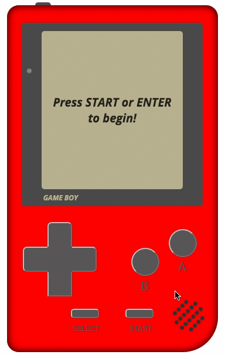

#Tetris
###### A remastered version of the classic gameboy game, built with vanilla Javascript (ES6) and jQuery.

##DEMO LIVE AT: [https://marcmoy.github.io/tetris/](https://marcmoy.github.io/tetris/)

##Feature Objectives
- Replicated game version of Tetris with comparable game logic and gameplay experience.
- Dynamic level difficulty and scoring.
- 'Gameboy' styled interface that is responsive to users playing on a mobile device.
- Classic Tetris [music](https://www.youtube.com/watch?v=NmCCQxVBfyM) (with mute button).
- Start/Pause ability.

##Bonus Features
- '[Piece hold](http://tetris.wikia.com/wiki/Hold_piece)' ability.
- CSS animations that will 'build' the gameboy upon entering the page. (See examples [1](https://codepen.io/heero/pen/wylhv) and [2](http://bchanx.com/animated-gameboy-in-css)).
