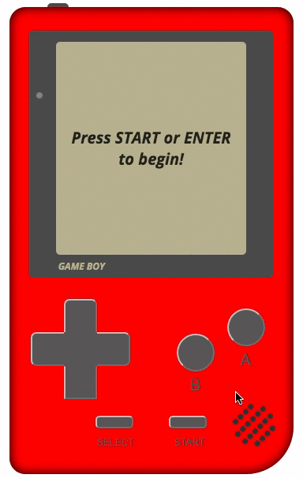
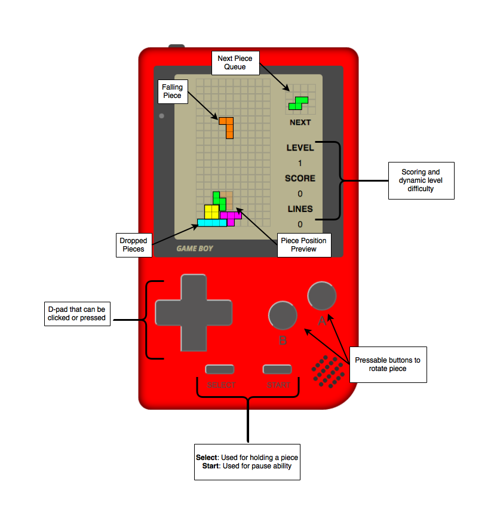

#Tetris
####A remastered version of the classic gameboy game, built with vanilla Javascript (ES6) and jQuery.

###DEMO LIVE AT: [https://marcmoy.github.io/tetris/](https://marcmoy.github.io/tetris/)

###Desktop Browser Game View

###Mobile Browser Game View

##Background
The basis of [Tetris](http://tetris.wikia.com/wiki/Tetris_Wiki) is to score points by arranging [Tetromino](https://en.wikipedia.org/wiki/Tetromino) pieces into positions that will produce [line clears](http://tetris.wikia.com/wiki/Line_clear). As a Tetromino piece falls down the 20x10 [playfield](http://tetris.wikia.com/wiki/Playfield), users can rotate or shift the position as the choose to fill and entire row. As soon as the row is filled, the line is cleared and points are awarded. Users will lose if the entire board filled with no cleared lines.

##Feature Objectives
- Replicated game version of Tetris with comparable game logic and gameplay user experience.
- Dynamic level difficulty and scoring.
- 'Gameboy' styled interface that is responsive to users playing on a mobile device.

##Bonus Features
- Start/Pause ability.
- CSS animations that will 'build' the gameboy upon entering the app. (See examples [one](https://codepen.io/heero/pen/wylhv) and [two](http://bchanx.com/animated-gameboy-in-css)).
- '[Piece hold](http://tetris.wikia.com/wiki/Hold_piece)' ability.

##Functionality and MVP
- [ ] Render playfield with falling pieces that stack
- [ ] Allow users to direct/rotate falling pieces
- [ ] Clear lines as pieces 'fill' a row
- [ ] Render next piece in queue
- [ ] Award points and raise difficulty as users' scores increase

##Architecture and Technologies

This game will be implemented using the following technologies:

- Vanilla Javascript (ES6) and jQuery to fulfill the overall game logic and structure.
- Redux to manage state (refer to [sample state](https://github.com/marcmoy/tetris/blob/master/docs/sample_state.md) and [sample actions](https://github.com/marcmoy/tetris/blob/master/docs/sample_actions.md)).
- Webpack to bundle and compile multiple scripts.

In addition to the webpack entry file, there will be multiple scripts to handle the logic behind the various classes needed to execute the game.

- `tetris_view.js`: Will handle the logic for rendering and updating the playfield.
- `falling_piece.js`: Will manage the state of the falling piece.
- `piece_queue.js`: Will contain the actions to render a new random falling piece.
- `playfield.js`: Will be fed the new game state to render the state of the playing field.
- `line_clear.js`: Checks if lines are cleared on the playfield.
- `pieces.js`: Holds the settings for each type of Tetromino.
- `score.js`: Manages the points, # of lines cleared, and level difficulty settings.

##Sample Wireframe

##Implementation Timeline

###Day 1
- [x] Setup basic file structure and webpack config.
- [ ] Render initial playfield. (`tetris_view.js` and `playfield.js`)
- [ ] Setup different piece settings for each Tetromino (`pieces.js`).
- [ ] Create game interval that will render the 'falling piece' effect **AND** 'dropped piece' effect (`falling_piece.js`).

###Day 2
- [ ] Design logic that will determine if a piece can be moved/rotated.
- [ ] Add key event listeners for users to control a falling piece (using `keymaster.js`).
- [ ] Create game logic to determine if lines are cleared (`line_clear.js`).

###Day 3
- [ ] Design random piece generator and next queue (`piece_queue.js`).
- [ ] Design point system, dynamic level difficulty, and line clear counting (`score.js`).
- [ ] Test and play game.

###Day 4
- [ ] Fine tune any bugs or features.
- [ ] Complete styling.

###Bonus
- [ ] Add start/pause feature.
- [ ] Implement CSS animation that will 'build' the gameboy upon entering the app. (See examples [one](https://codepen.io/heero/pen/wylhv) and [two](http://bchanx.com/animated-gameboy-in-css)).
- [ ] Create piece hold feature.
- [ ] Add classic Tetris [music](https://www.youtube.com/watch?v=NmCCQxVBfyM) (with mute button).
